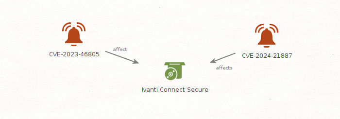

## Visual analysis

The graph provides a minimal visual representation of the relationship between the affected CVEs and the Ivanti Connect Secure product.

It highlights:
- two distinct CVEs impacting the same enterprise access gateway
- a clear, non-interpretative relationship (`affects`)
- the convergence of risk on a single Internet-facing component

The graph is intentionally minimal and is used to support analytical reasoning, not to model attack paths or attribution.

